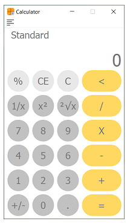
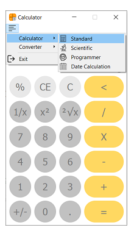
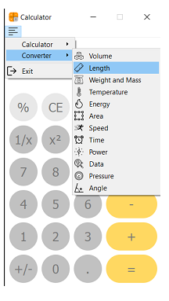

<!-- Step-1 Identify the project -->

# Calculator

[Github Repository](https://github.com/gursimarkaur999/Calculator, 'Calculator')

###### By Author Gursimar Kaur
---
<!-- Step-2 Evaluate the project -->
With this you can do basic-intermediate level calculations with handy GUI. Both keyword strokes and mouse click can be used to operate this system.
    


<!-- Now describe who can use the project -->
### Features
1. 4 calculators that are: Standard, Scientific, Programmer and Date Calculator.
 
2. 12 converters: Volume, area, data, pressure, power, temperature, angle, length, time, weight and mass, speed and energy. 
 
### Users
* Anyone.
---
<!-- Step-3 Help reader to use the project -->

### Project Prerequisties
Before cloning our project you require:
* Python3
* Python Editor (Required python3 must be in path 
variable)

### Installation Steps
1. Clone the repository.
2. Open project in editor.
3. Install all 'requirement.txt' file packages or u can use command as shown below:
    ```python
    pip install -r requirements.txt
    ```
    _**Note**: Refer to [link](https://github.com/sameersharma1999/Billing-Project) for proper understanding._
4. Move to MyApp > App.py and execute the code. Screenshots are as shown below:
---
<!-- Step-4 Engage -->
<!-- How to report a Bug -->
### How to report bug?
Mail us at gursimarkaur725@gmail.com
